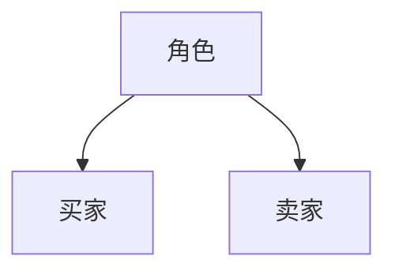
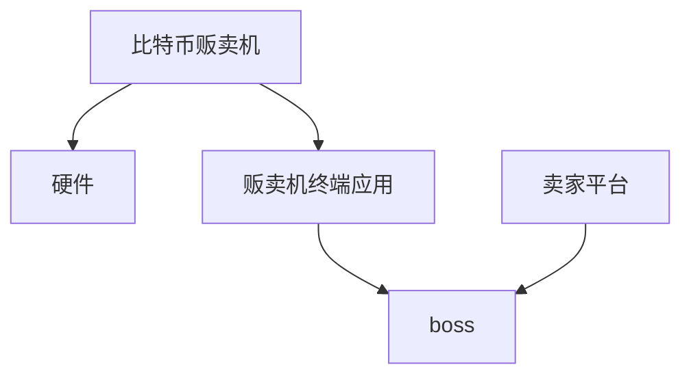
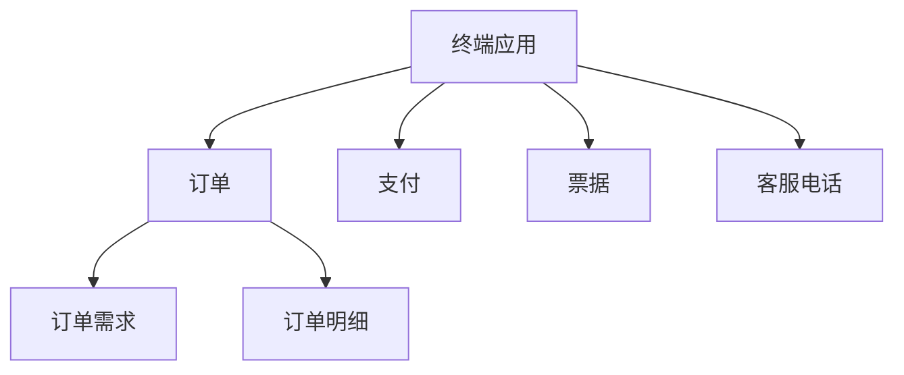
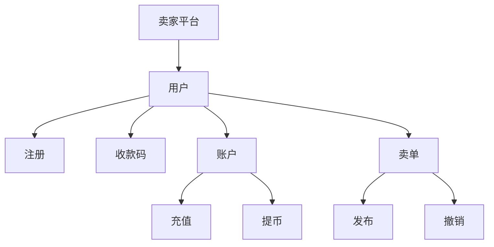
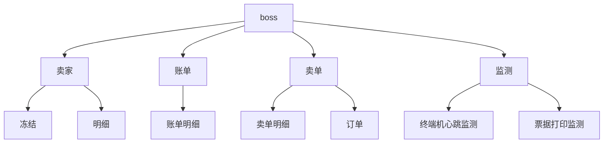
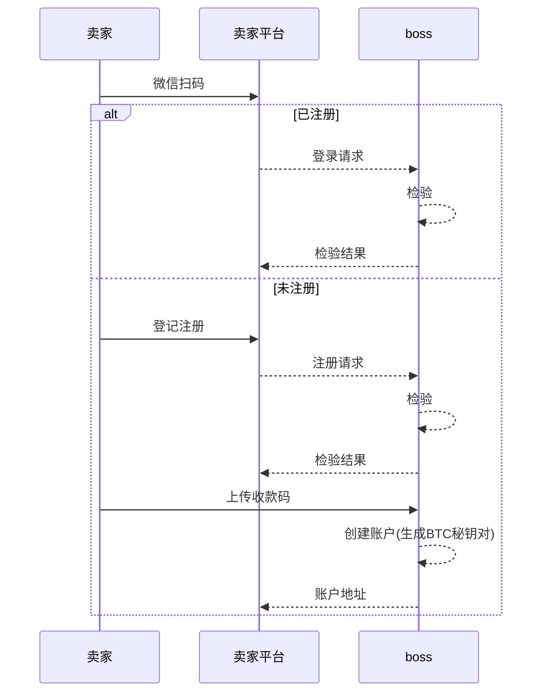
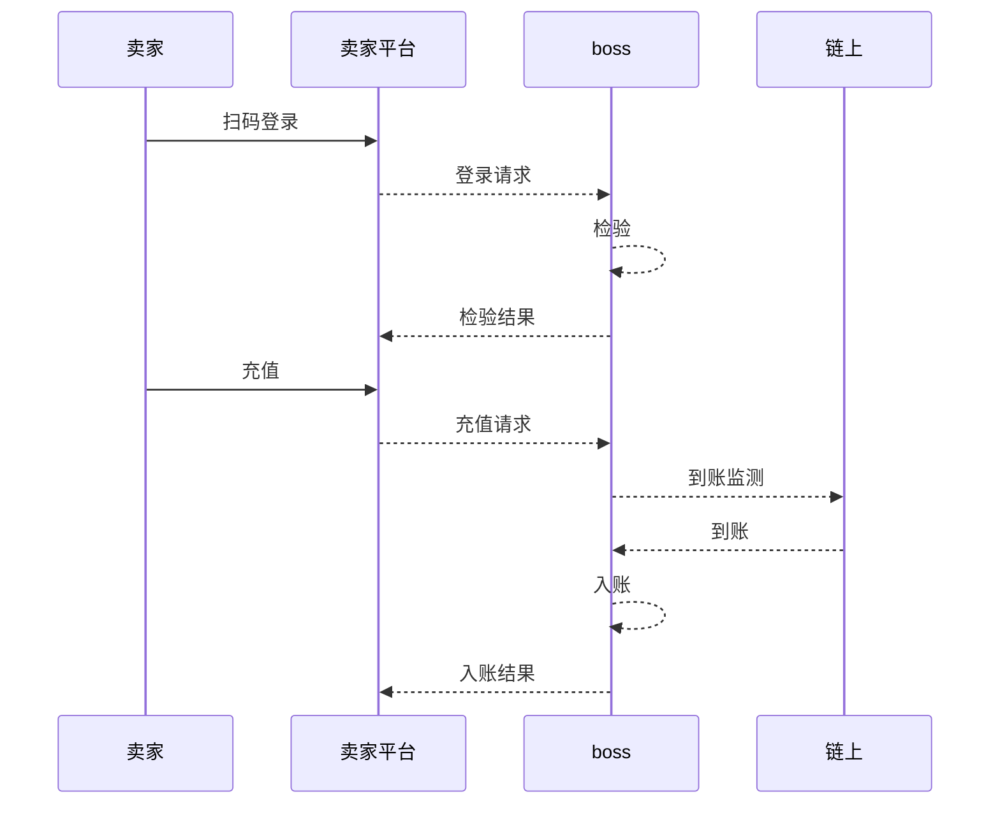
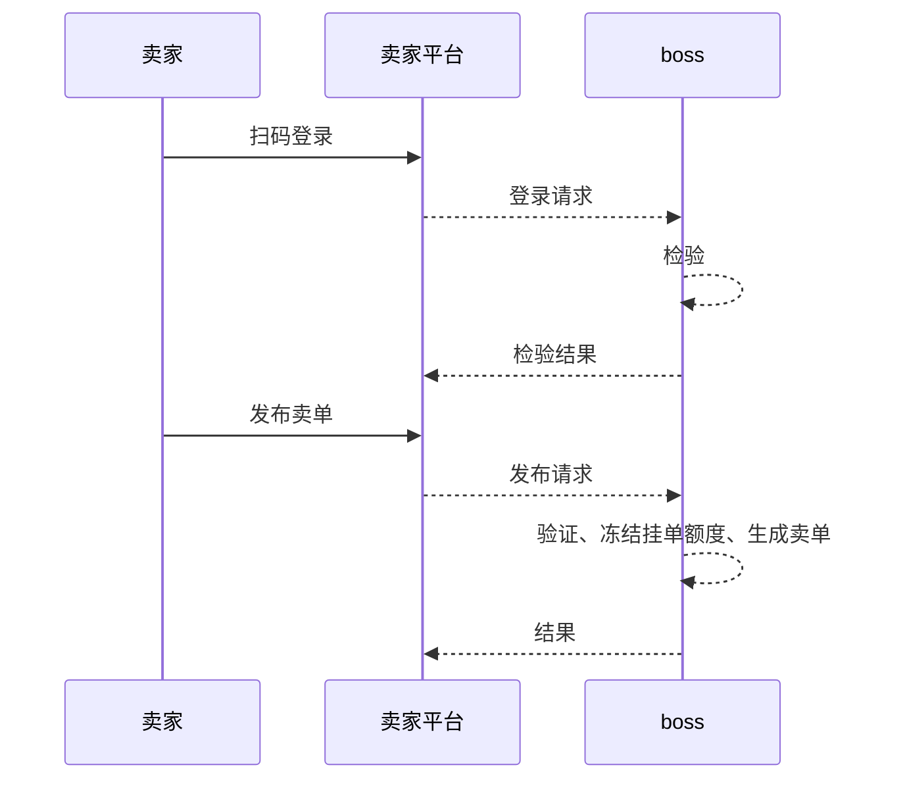
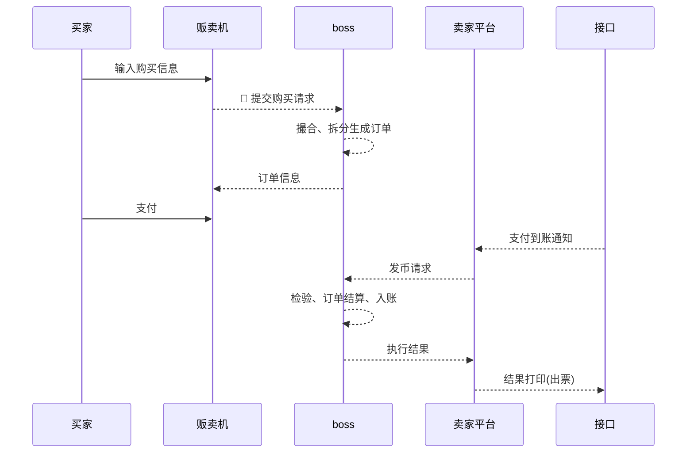
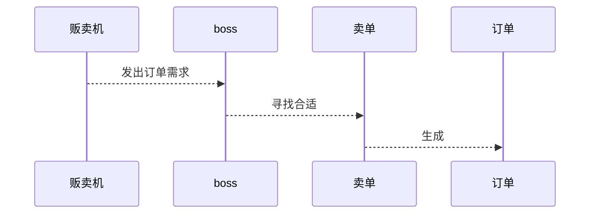

# 比特币贩卖机产品设计

### 一、角色

1.买家：负责购买比特币  
2.卖家：负责出售比特币  

### 二、功能模块

#### 2.1  总体产品结构

#### 2.1  功能模块：贩卖机终端应用

#### 接口清单及描述 
|序号|接口|描述|
|-|-|-|
|1|支付宝支付接口|用于购买比特币法币支付|
|2|微信支付接口|用于购买比特币法币支付|
|3|票据打印接口|用于比特币秘钥单打印|
|4|微信店小二接口|用于通知法币到账转出BTC|
|5|支付宝店小二接口|用于通知法币到账转出BTC|

#### 票据内容
|序号|内容|
|-|-|
|1|私钥|
|2|私钥条码|
|3|BTC|
|4|购买数量|
|5|支付金额|
|6|时间|
|7|公众号信息|

#### 订单需求内容
|序号|内容|
|-|-|
|1|终端ID|
|2|数量|
|3|金额|
|4|请求时间|

#### 订单明细
|序号|内容|
|-|-|
|1|数量|
|2|实际支付金额|
|3|卖家姓名|
|4|付款方式|

1).卖单：终端不显示卖家的发布的卖单记录以及卖家信息，买家只需要输入金额或购买比特币数量，系统自动匹配卖单，当确认后根据购买需求拆分卖单，对应购买部分冻结，并转到支付页面。

#### 2.2  功能模块：卖家平台

1).发布卖单：  
假设平台手续费率为10%，网络费用忽略不计 
卖家看到的：实际卖家发布的卖单，如：1BTC = 28000 元。  
买家看到的：添加了平台手续费、网络费用的卖单，如：1BTC = 30800元。  
3).收款放币：  
假设买家支付3080元购买0.1个比特币
卖家看到的确认单显示：3080元购买0.11比特币，确认后，买家收到0.1比特币，平台收入0.01比特币手续费

#### 2.3  功能模块：boss

### 三、流程案例

#### 3.1 流程案例：卖家注册

1).登记注册：用户扫码后如未注册，则需上传收款码，同时系统为该用户创建账户，同时生成BTC秘钥对，仅向该用户展现公钥，用于账户BTC充值

#### 3.2 流程案例：卖家充值

#### 3.4 流程案例：卖家发布卖单

#### 3.4 流程案例：卖家撤销卖单

#### 3.5 流程案例：买家购买比特币

#### 目标：
1.买家可以通过终端

#### 问题；
1.购买方式有哪些？  
买家可以按法币和比特币两种方式进行购买，终端提供几档法币和比特币快速选择，也可输入法币金额和比特币数量进行购买。
2.是否需要根据不同终端放置环境的消费能力进行档位设置？
3.如果每一个卖家无法满足买家的买入量，怎么办？

1) 支付： 支付页面周期为30秒，超过30秒，自动取消订单.

#### 3.6 流程案例 

#### 3.7 流程案例：订单撮合

1). 寻找合适卖单要素:  
    A.单一卖单总金额 >= 购买需求（在扣除平台利润及网络费用前提下）.  
    B.BTC单价最低.  
2).生成订单要求：   
    A.当某卖单预售生成订单时，不允许卖家撤销该卖单，待订单成功或超时取消后方可撤销卖单。
    B.当买家发出预购买请求时（即出现支付码前）生成订单，并计算卖单当前可售额度，防止不同买家同时购买同一卖家的BTC导致重复支付问题。

### 4. 需求瓶颈与解决方案

1).到账通知问题：3个买家购买，2个支付，1个未支付，如何判定?  

卖家平台平台选型(安卓、桌面程序、web)

卖家账户如何保存？按照恒星思路，使用一个账户，还是每个卖家分配一个btc地址

