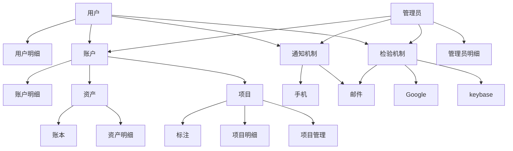
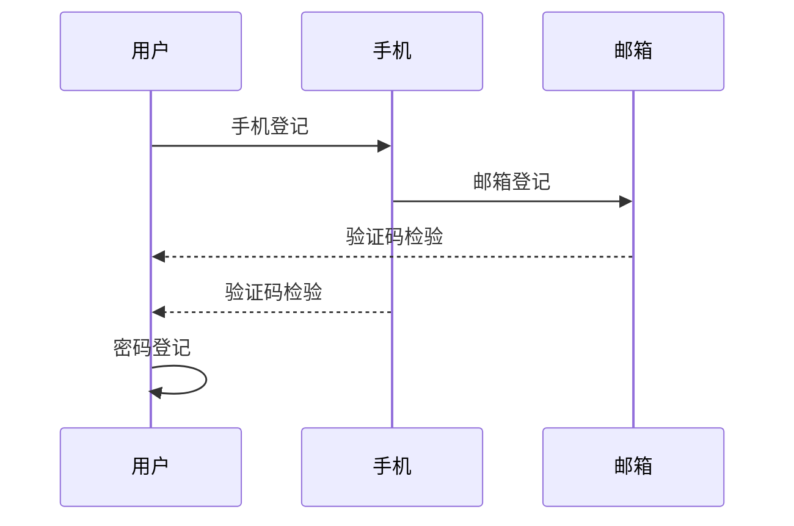
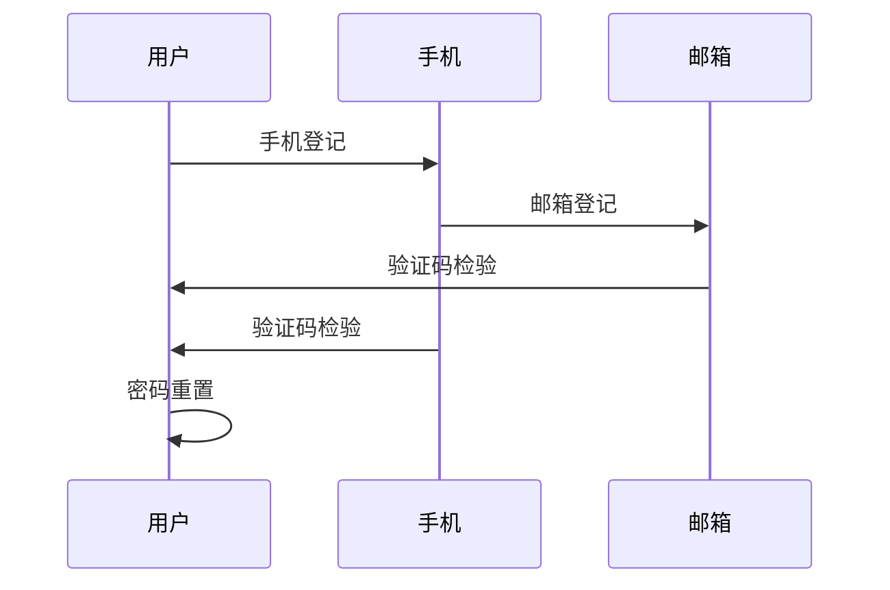
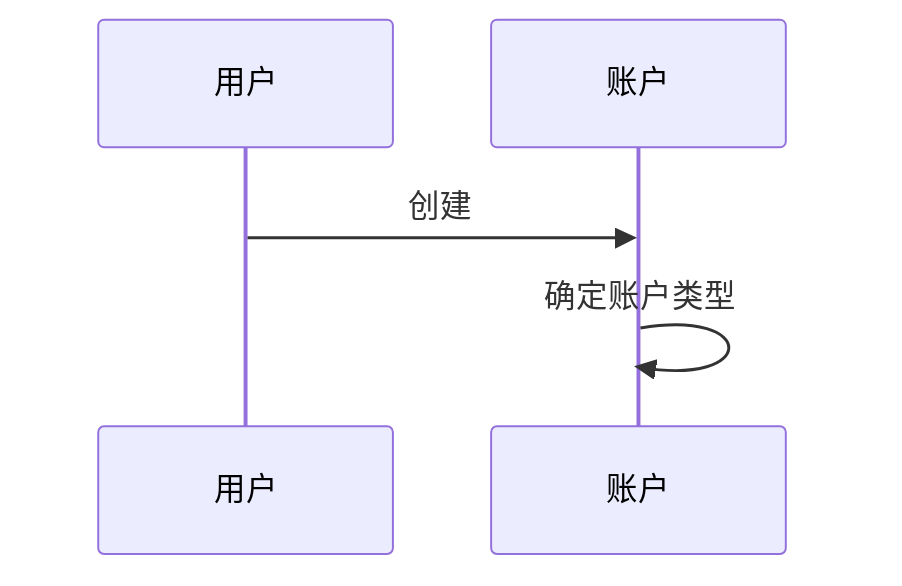
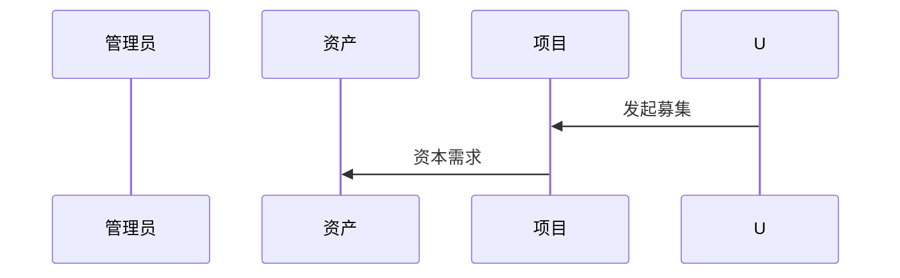

## 模块划分

```mermaid
graph TB

用户 --> 用户明细
用户 --> 账户
用户 --> 检验机制
用户 --> 通知机制
账户 --> 账户明细
账户 --> 资产
资产 --> 账本
资产 --> 资产明细
项目 --> 标注
账户 --> 项目
项目 --> 项目明细
项目 --> 项目管理
管理员 --> 管理员明细
管理员 --> 账户
管理员 --> 检验机制
管理员 --> 通知机制
通知机制 --> 手机
通知机制 --> 邮件
检验机制 --> 邮件
检验机制 --> Google
检验机制 --> keybase


```

流程案例：用户登记

```mermaid

sequenceDiagram
    participant U as 用户
    participant P as 手机
    participant M as 邮箱

    U->>P: 手机登记
    P->>M: 邮箱登记
    M-->>U: 验证码检验
    P-->>U: 验证码检验
    U->>U: 密码登记

```

流程案例：用户密码重置

```mermaid

sequenceDiagram
    participant U as 用户
    participant P as 手机
    participant M as 邮箱

    U->>P: 手机登记
    P->>M: 邮箱登记
    M->>U: 验证码检验
    P->>U: 验证码检验
    U->>U: 密码重置

```

流程案例：账户创建

```mermaid

sequenceDiagram
    participant U as 用户
    participant A as 账户

    U->>A: 创建
    A->>A: 确定账户类型

```

流程案例：用户冻结

```mermaid

sequenceDiagram
    participant S as 管理员
    participant A as 资产
    participant P as 项目

    U->>P: 发起募集
    P->>A: 资本需求

```

流程案例：充提资金

```mermaid

sequenceDiagram
    participant S as 管理员
    participant A as 资产
    participant P as 项目

    U->>P: 发起募集
    P->>A: 资本需求

```

