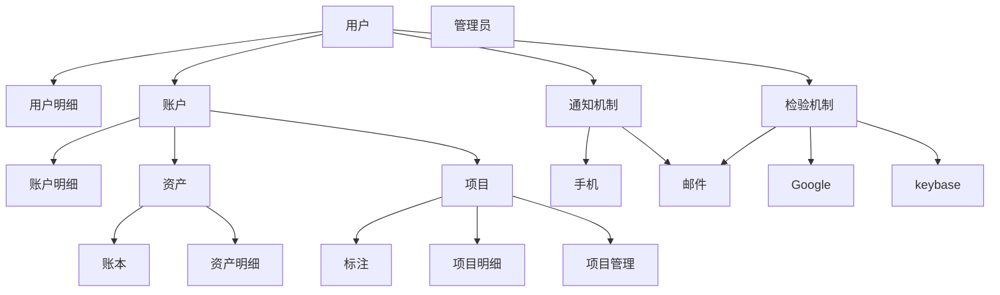
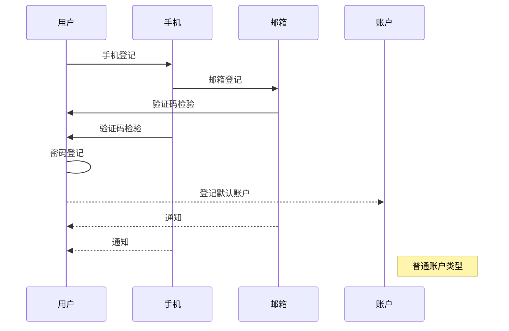
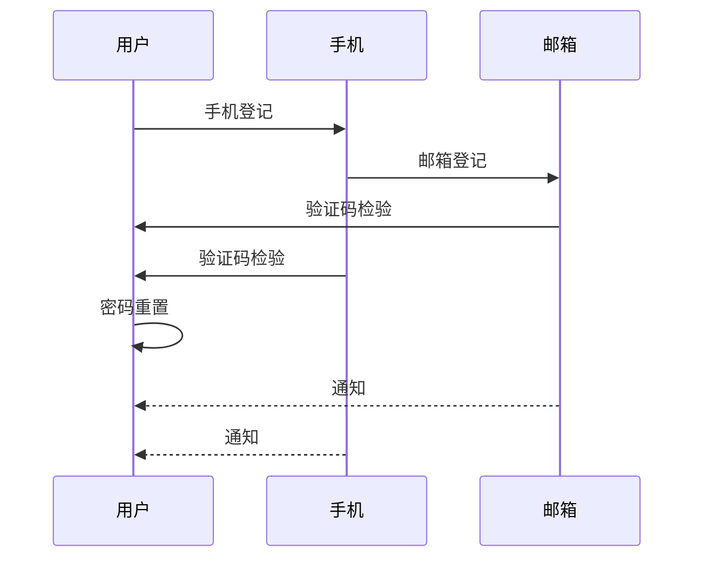
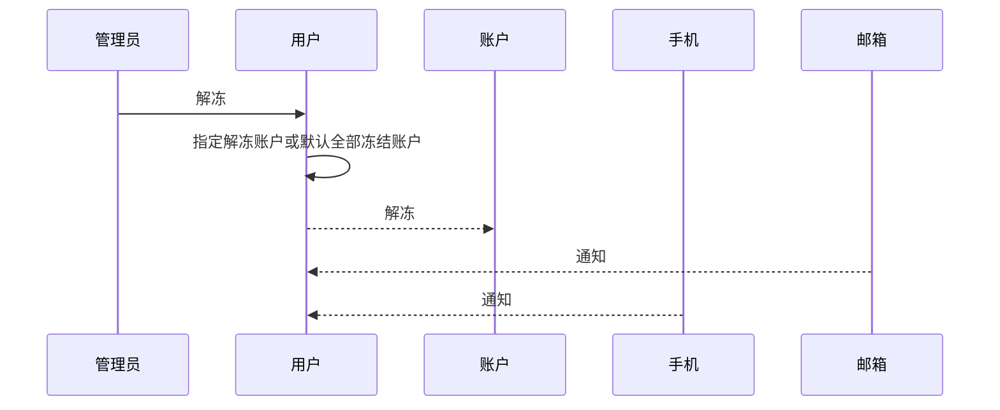
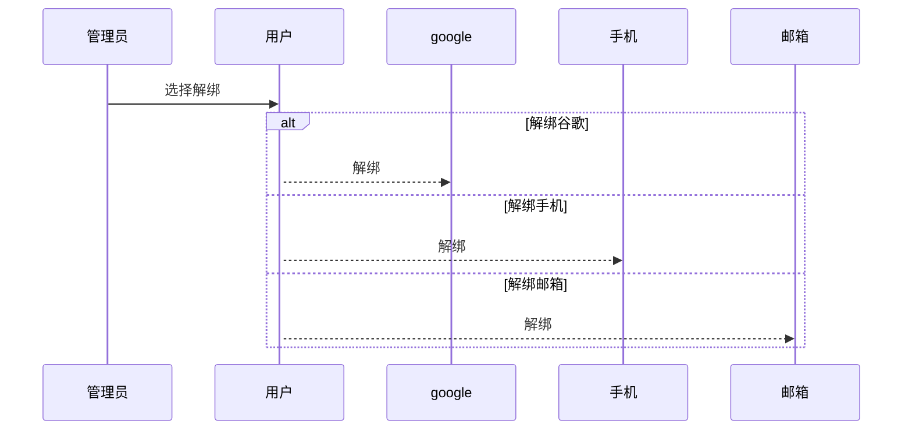

# 源铸产品设计
## 模块划分

```mermaid
graph TB

用户 --> 用户明细
用户 --> 账户
用户 --> 检验机制
用户 --> 通知机制
账户 --> 账户明细
账户 --> 资产
资产 --> 账本
资产 --> 资产明细
项目 --> 标注
账户 --> 项目
项目 --> 项目明细
项目 --> 项目管理
管理员
通知机制 --> 手机
通知机制 --> 邮件
检验机制 --> 邮件
检验机制 --> Google
检验机制 --> keybase


```

流程案例：用户登记

```mermaid

sequenceDiagram
    participant u as 用户
    participant p as 手机
    participant m as 邮箱
    participant a as 账户

    u->>p: 手机登记
    p->>m: 邮箱登记
    m->>u: 验证码检验
    p->>u: 验证码检验
    u->u: 密码登记
    u-->>a: 登记默认账户
    m-->>u: 通知
    p-->>u: 通知
    Note right of a: 普通账户类型

```

流程案例：用户密码重置

```mermaid

sequenceDiagram
    participant u as 用户
    participant p as 手机
    participant m as 邮箱

    u->>p: 手机登记
    p->>m: 邮箱登记
    m->>u: 验证码检验
    p->>u: 验证码检验
    u->>u: 密码重置
    m-->>u: 通知
    p-->>u: 通知

```

流程案例：用户冻结

```mermaid

sequenceDiagram
    participant s as 管理员
    participant u as 用户
    participant a as 账户
    participant p as 手机
    participant m as 邮箱

    s->>u: 冻结
    u->>u: 指定账户或默认全部账户
    u-->>a: 冻结
    m-->>u: 通知
    p-->>u: 通知

```

流程案例：用户解冻

```mermaid

sequenceDiagram
    participant s as 管理员
    participant u as 用户
    participant a as 账户
    participant p as 手机
    participant m as 邮箱

    s->>u: 解冻
    u->>u: 指定解冻账户或默认全部冻结账户
    u-->>a: 解冻
    m-->>u: 通知
    p-->>u: 通知

```

流程案例：用户检验信息解绑

```mermaid

sequenceDiagram
    participant s as 管理员
    participant u as 用户
    participant g as google
    participant p as 手机
    participant m as 邮箱

    s->>u: 选择解绑
    activate u
    alt 解绑谷歌
        u-->>g: 解绑
    else 解绑手机
        u-->>p: 解绑
    else 解绑邮箱
        u-->>m: 解绑
    end
```

