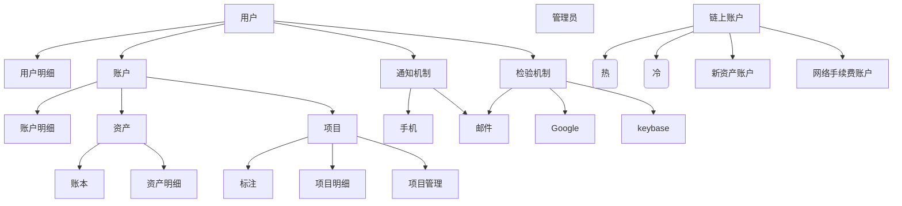
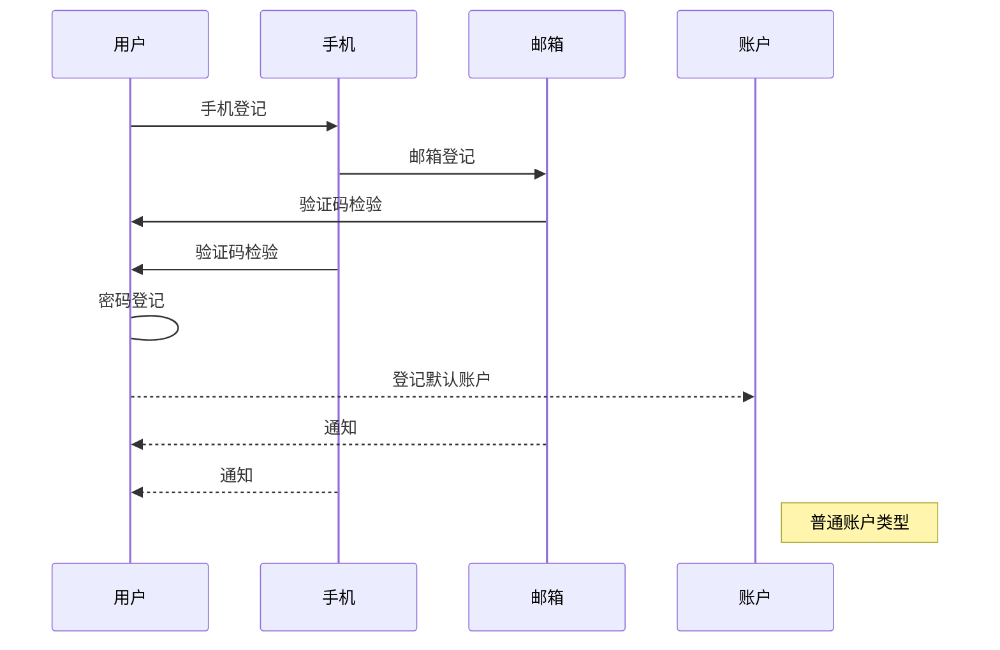
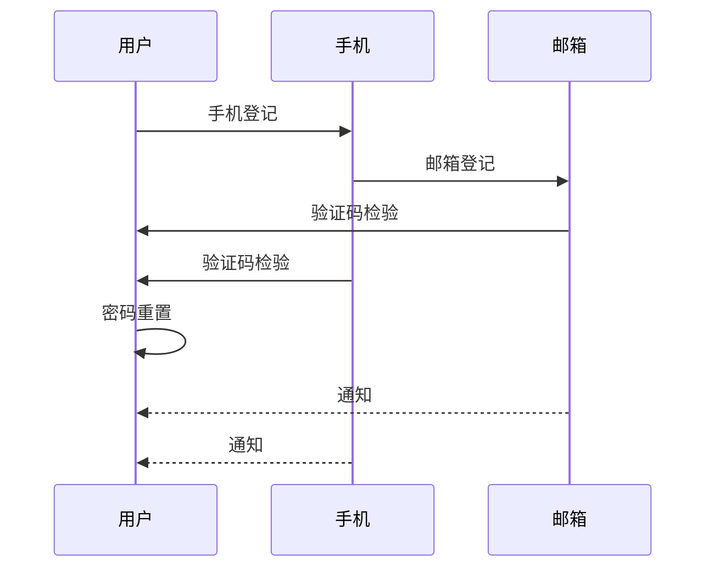
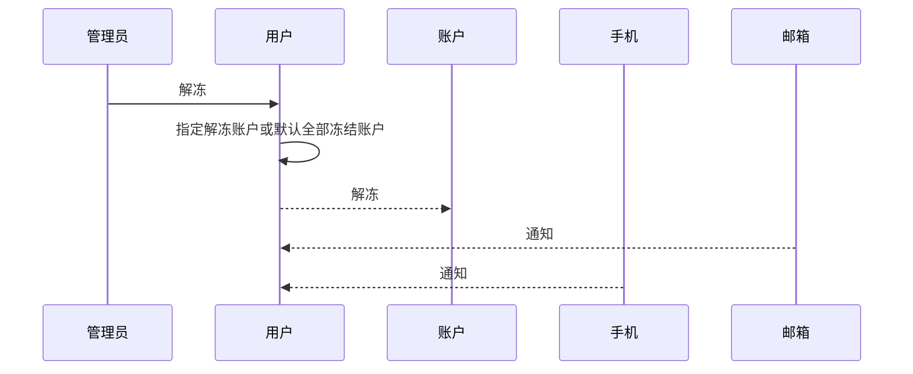
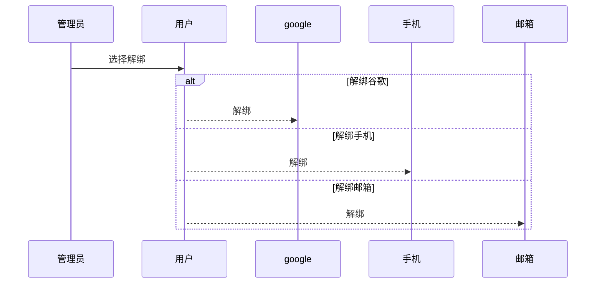
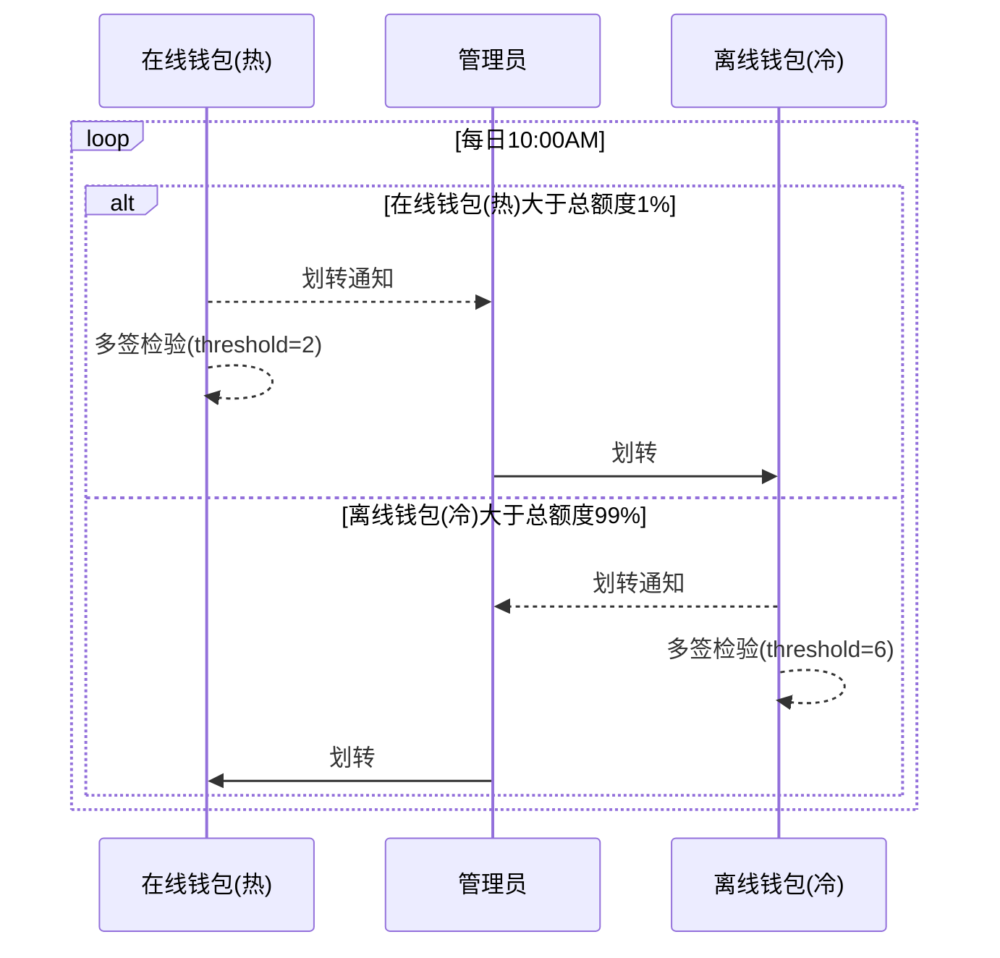
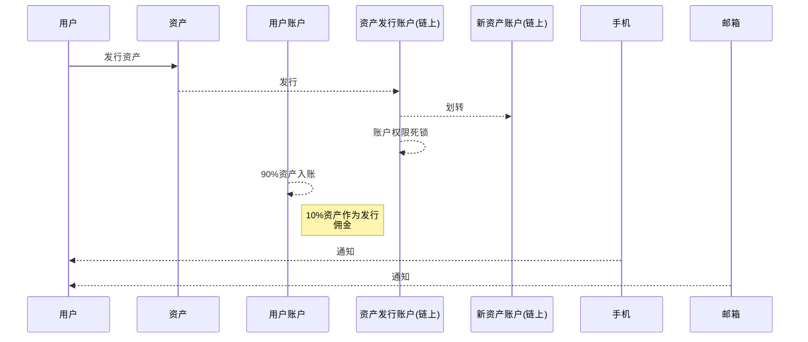
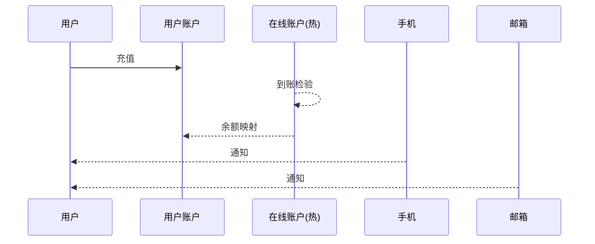
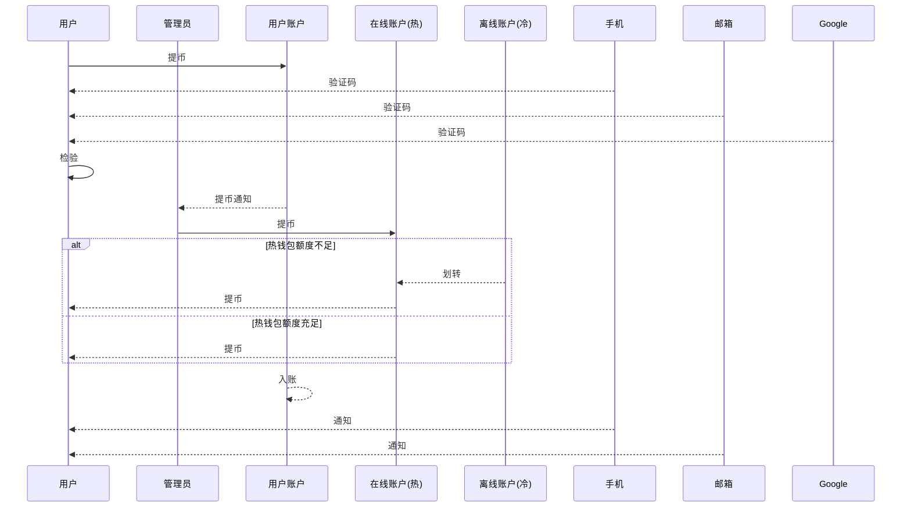

# 源铸产品设计
## 一、模块划分

## 二、流程案例

流程案例：用户登记

流程案例：用户密码重置

流程案例：用户冻结

流程案例：用户解冻

流程案例：用户检验信息解绑

流程案例：在线钱包(热)&离线钱包(冷)

流程案例：资产发行

流程案例：充值

流程案例：提币

## 三、属性

### 1.用户明细

| 序号 | 字段 | 备注 |
| ------ | ------ | ------ |
| 1 | 手机 |  |
| 2 | 邮箱 |  |
| 3 | Google | |
| 4 | 昵称 | |

