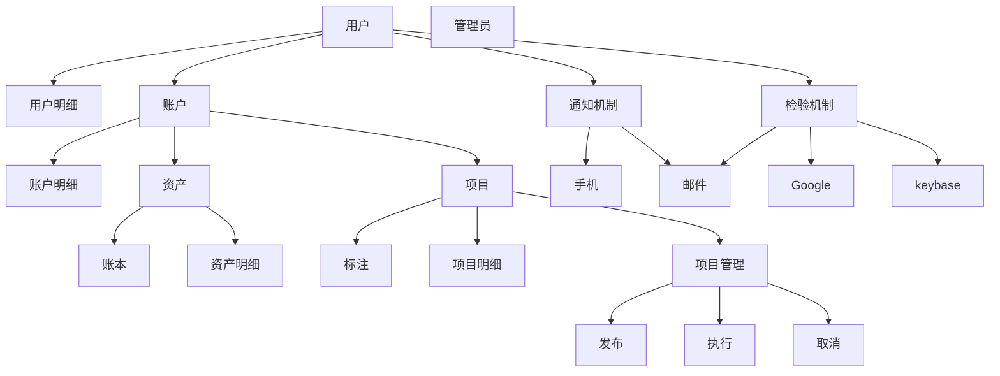
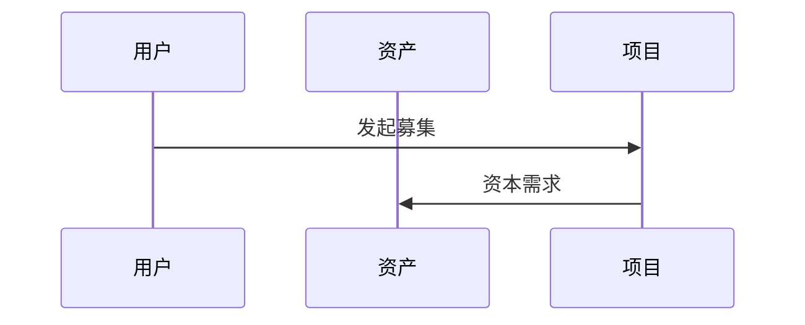
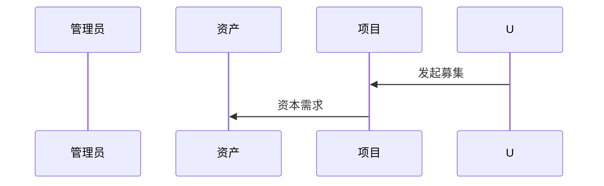

## 模块划分

```mermaid
graph TB

用户 --> 用户明细
用户 --> 账户
用户 --> 检验机制
用户 --> 通知机制
账户 --> 账户明细
账户 --> 资产
资产 --> 账本
资产 --> 资产明细
项目 --> 标注
账户 --> 项目
项目 --> 项目明细
项目 --> 项目管理
项目管理 --> 发布
项目管理 --> 执行
项目管理 --> 取消
管理员 
通知机制 --> 手机
通知机制 --> 邮件
检验机制 --> 邮件
检验机制 --> Google
检验机制 --> keybase


```

流程案例：用户验证`

```mermaid

sequenceDiagram
    participant U as 用户
    participant A as 资产
    participant P as 项目

    U->>P: 发起募集
    P->>A: 资本需求

```

流程案例：项目募集

```mermaid

sequenceDiagram
    participant U as 用户
    participant A as 资产
    participant P as 项目

    U->>P: 发起募集
    P->>A: 资本需求

```

流程案例：用户冻结

```mermaid

sequenceDiagram
    participant S as 管理员
    participant A as 资产
    participant P as 项目

    U->>P: 发起募集
    P->>A: 资本需求

```

流程案例：充提资金

```mermaid

sequenceDiagram
    participant S as 管理员
    participant A as 资产
    participant P as 项目

    U->>P: 发起募集
    P->>A: 资本需求

```

