# 源铸产品设计

## 产品概况
源铸平台是基于Jetmint[1]实现的去中心化投融平台，平台规范了项目方的代币发行，项目募集的流程，降低项目方跑路风险，保障代投机构、投资个体的资产安全，同时平台整合了ICO模式下的业务场景，实现了代币完整生命周期管理，包括代币的发行、募集、分发、回收、销毁以及二级市场的流通。

## 产品目标
1.利用Jetmint网络，实现全球投融项目的

## 解决的问题


## 一、模块划分

源铸社区组织结构
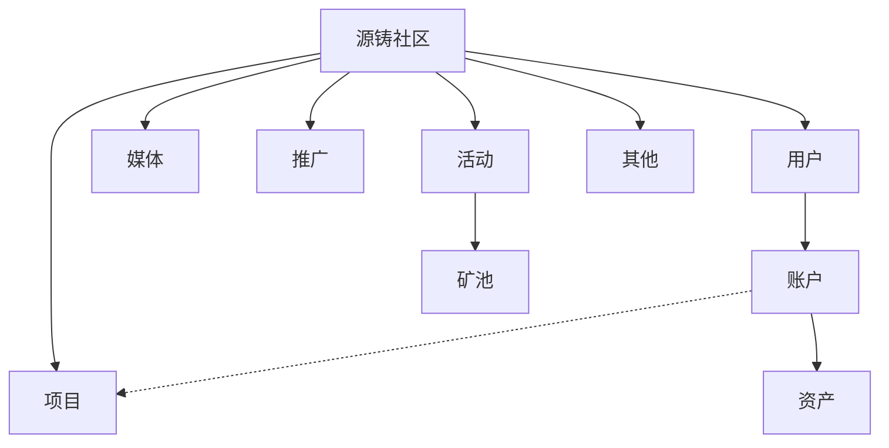

源铸媒体组织结构
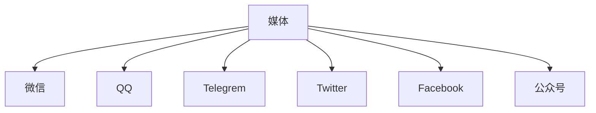

源铸其他组织结构
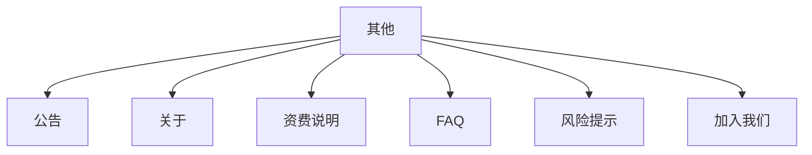

源铸推广组织结构
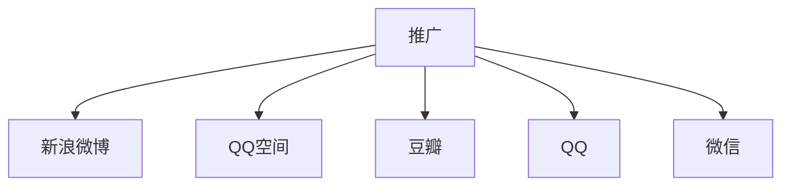

源铸用户组织结构
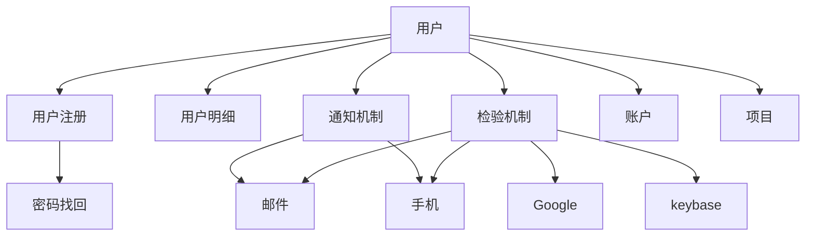

源铸账户组织结构
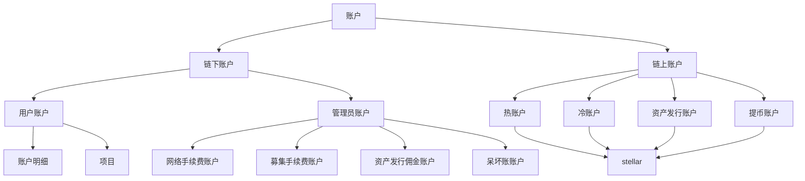

源铸资产组织结构
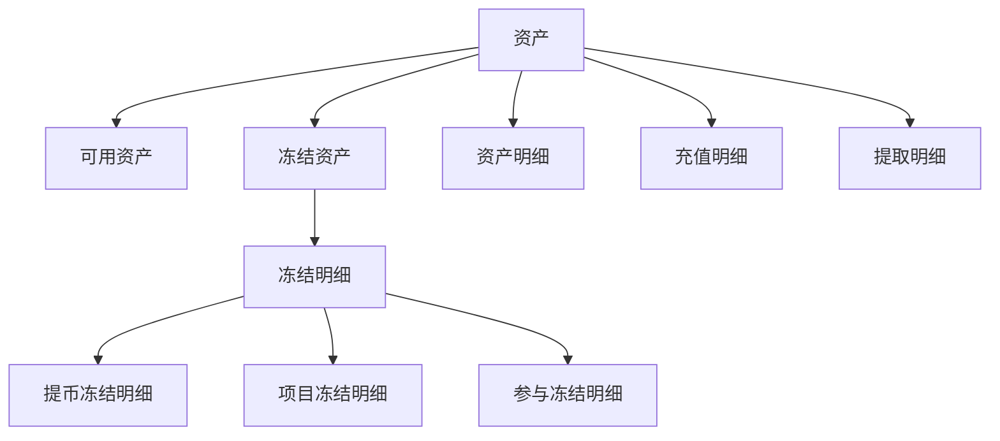

源铸项目组织结构
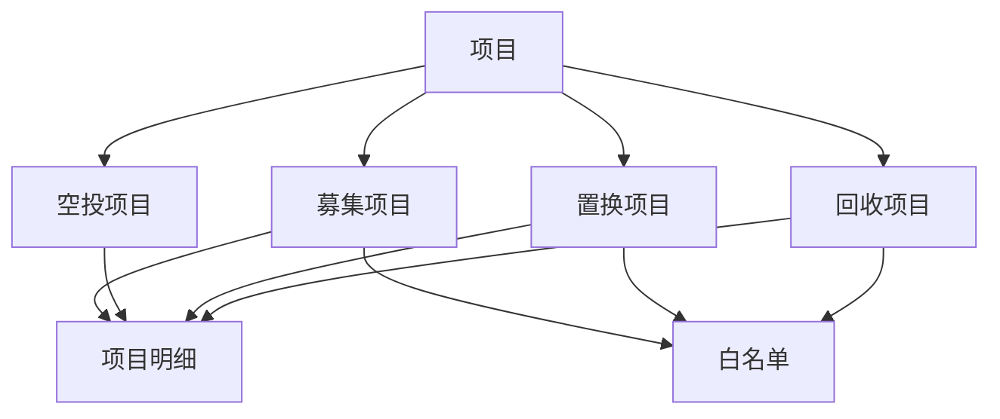

角色
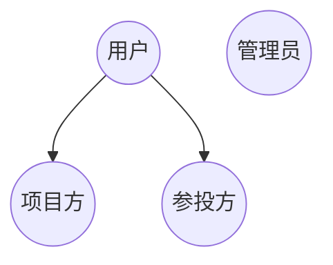


## 二、业务场景案例

### 1. 用户相关流程

流程案例：用户登记
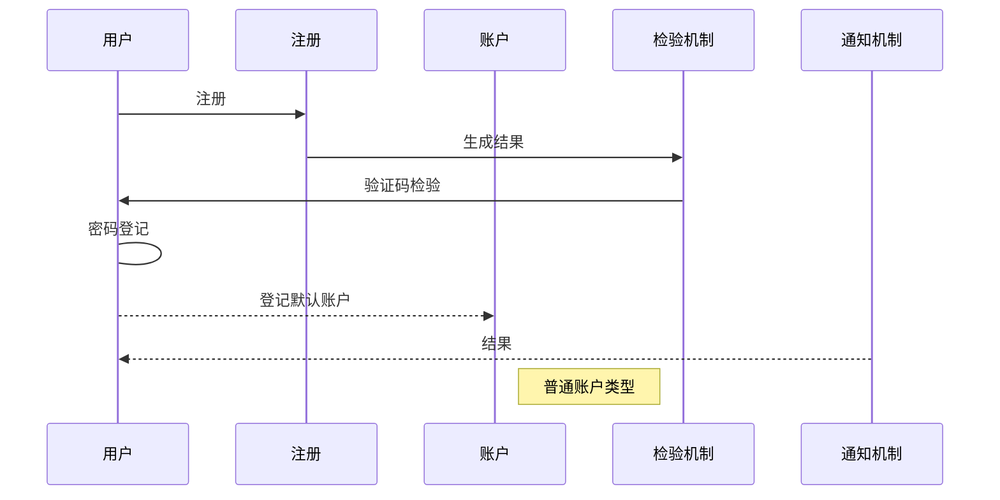

流程案例：用户密码重置
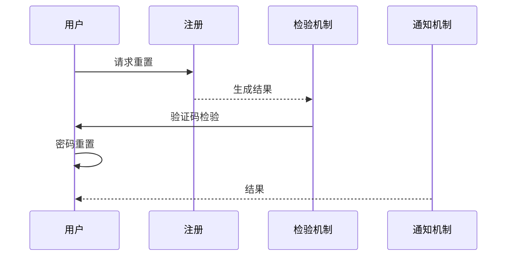

流程案例：用户冻结


流程案例：用户解冻
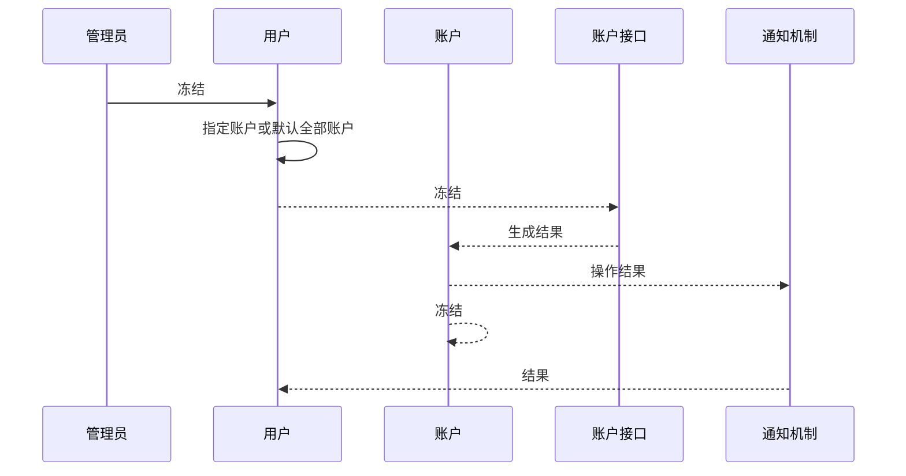

流程案例：用户检验信息解绑
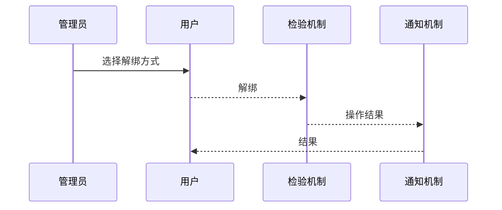

### 2. 资产管理

流程案例：源铸资产账户
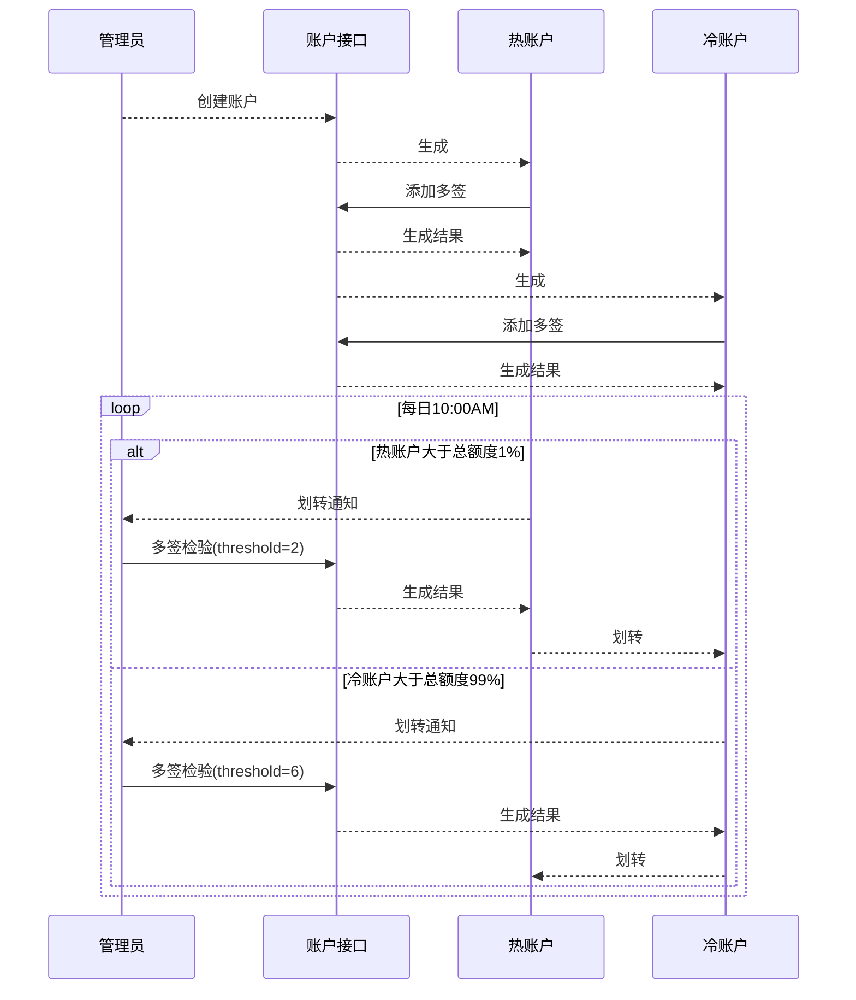

流程案例：资产发行
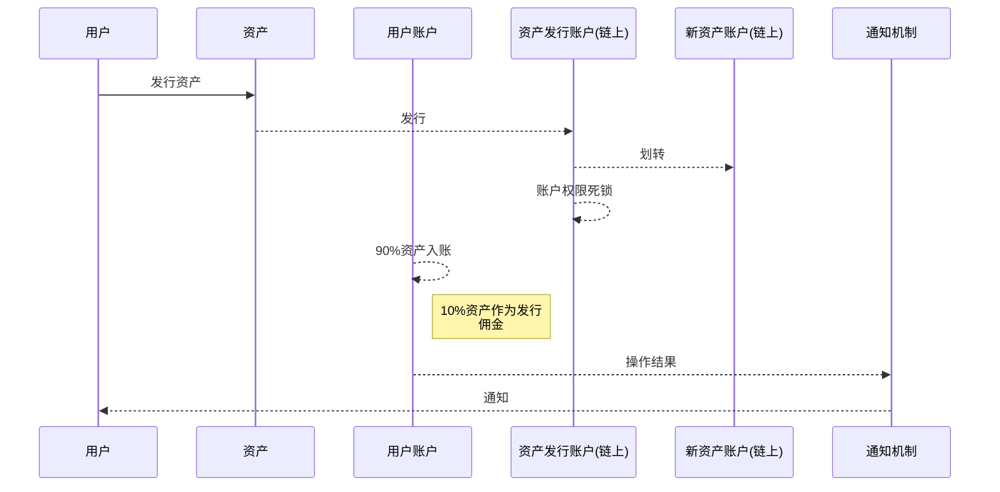

流程案例：充值
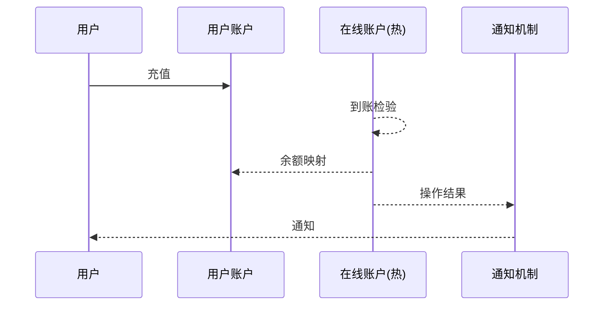

流程案例：提币
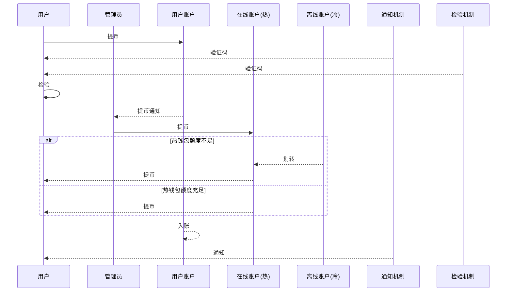

### 3. 项目管理

流程案例：募集项目管理
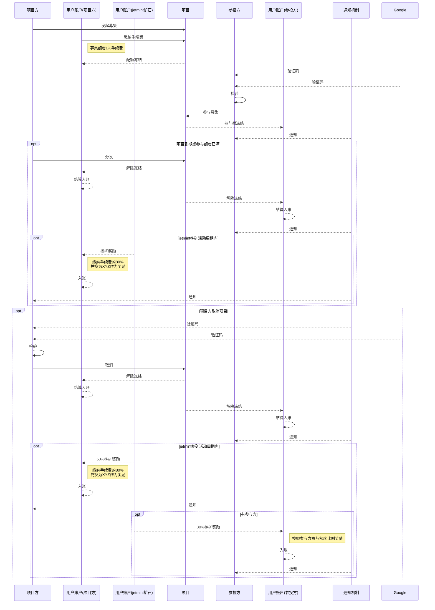

流程案例：置换项目管理
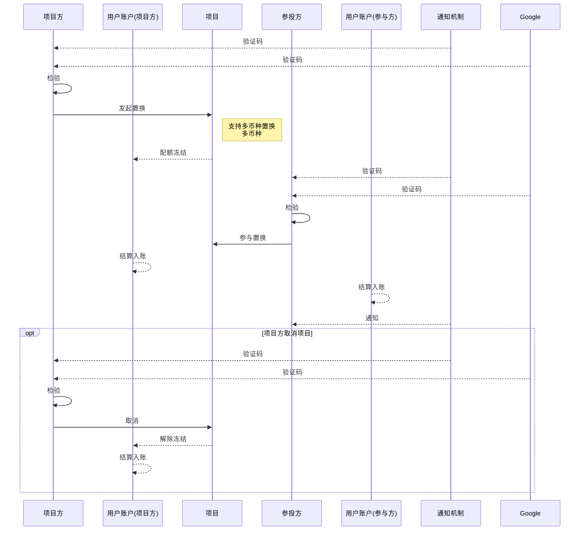

流程案例：回收项目管理
```mermaid
    sequenceDiagram
    participant u1 as 项目方
    participant a1 as 用户账户(项目方)
    participant pr as 项目
    participant u2 as 参投方
    participant a2 as 用户账户(参与方)
    participant n as 通知机制
    participant g as Google

    n-->>u1: 验证码
    g-->>u1: 验证码
    u1->>u1: 检验
    u1->>pr: 发起回收
        note right of pr:支持多币种回收<br>多币种,回收资产<br>进行销毁
    pr-->>a1: 配额冻结
    n->>u2: 验证码
    g-->>u2: 验证码
    u2->>u2: 检验
    u2->>pr: 参与回收
    a1-->>a1: 结算入账
    pr-->>pr: 创建黑洞账户，销毁
    a2-->>a2: 结算入账
    n-->>u2: 通知
    
    opt 项目方取消项目
        n-->>u1: 验证码
        g-->>u1: 验证码
        u1->>u1: 检验
        u1->>pr: 取消
        pr-->>a1: 解除冻结
        a1-->>a1: 结算入账
    end
```

流程案例：空投项目管理
```mermaid
    sequenceDiagram
    participant u1 as 项目方
    participant a1 as 用户账户(项目方)
    participant pr as 项目
    participant u2 as 参投方
    participant a2 as 用户账户(参与方)
    participant n as 通知机制
    participant g as Google

    opt 高级空投
        u1->>pr: 发起调研
        pr->>u1: 调研报告
        n-->>u1: 通知
    end 
    n-->>u1: 验证码
    g-->>u1: 验证码
    u1->>u1: 检验
    u1->>pr: 发起空投
    pr-->>a1: 配额冻结
    u2->>pr: 领取资格检验
    opt 资格有效
        u2->>a2: 地址认证及绑定
        u2->>pr: 领取空投
        a2-->>a2: 结算入账
        n-->>u2: 通知
    end
    opt 空投周期结束
        pr-->>a1: 解除冻结
        a1-->>a1: 结算入账
        n-->>u1: 通知
    end
```