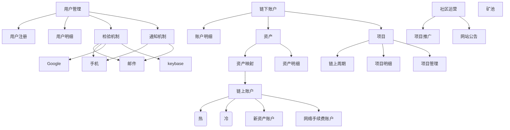
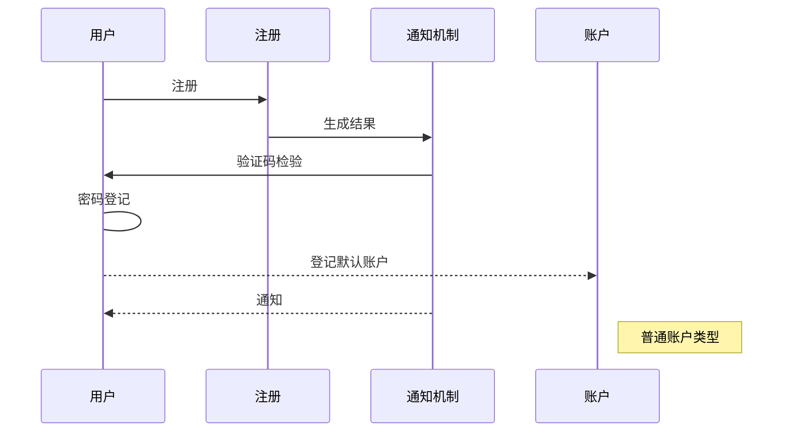
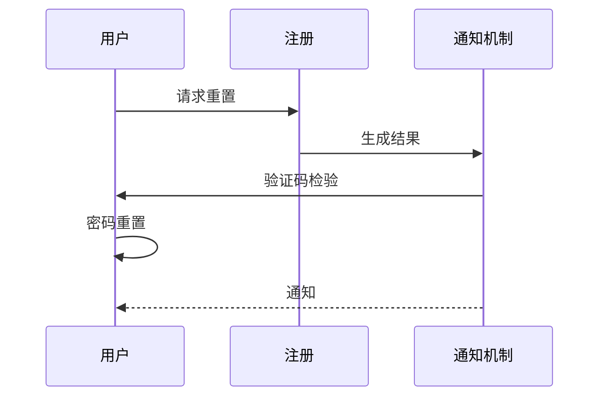
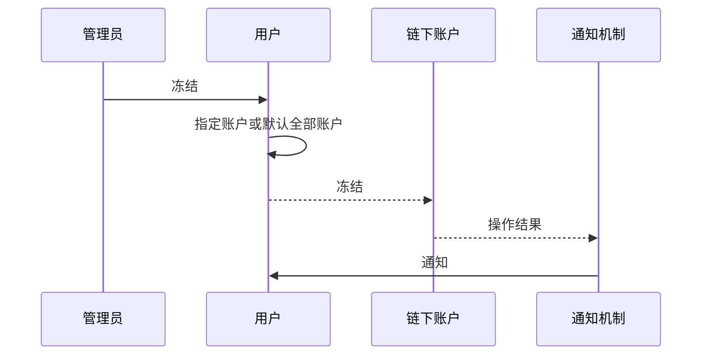
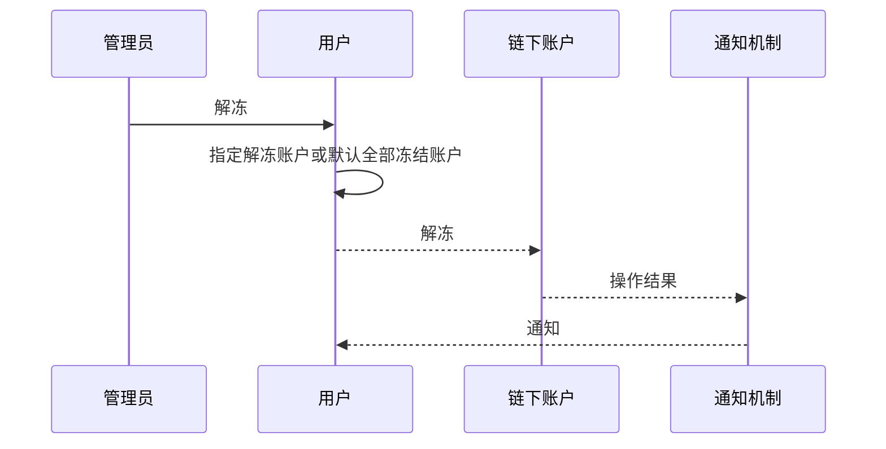
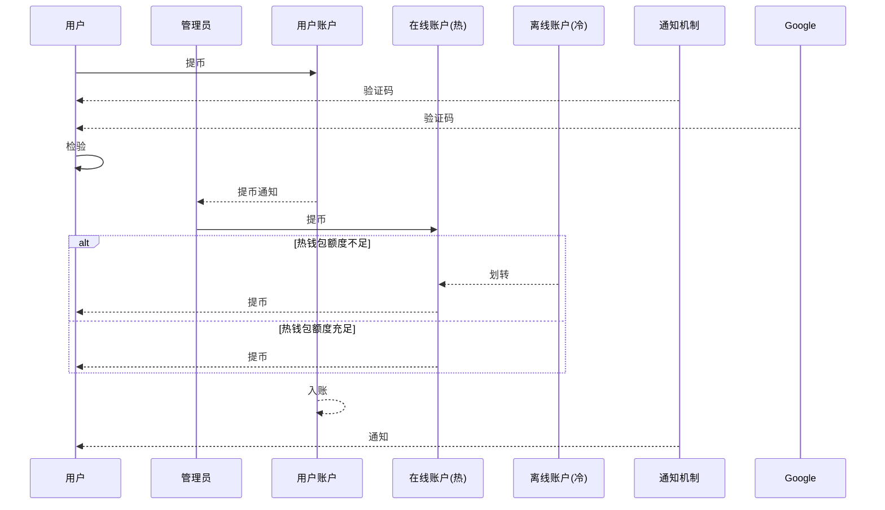
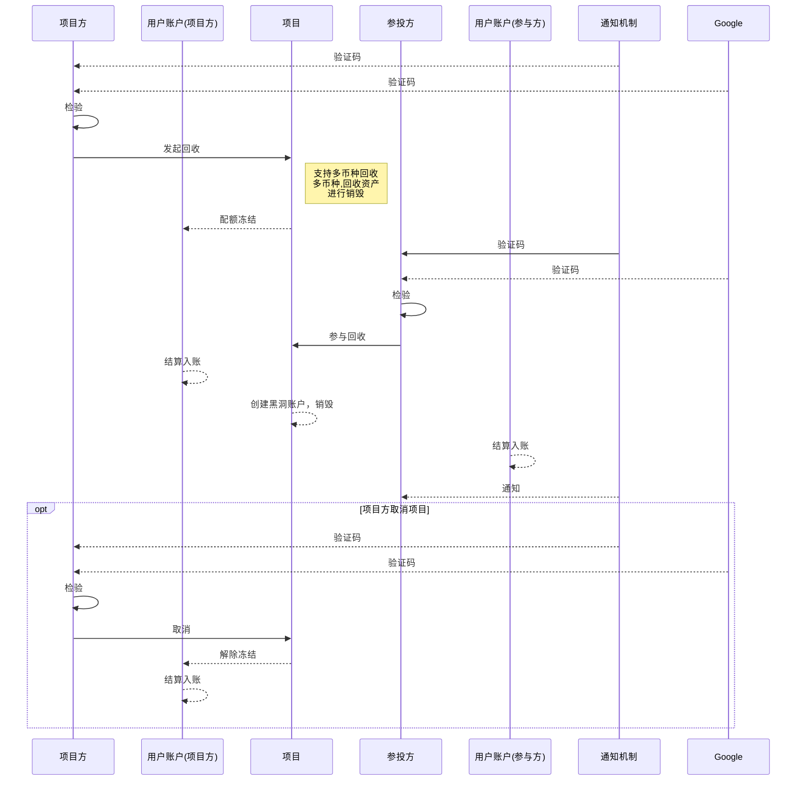
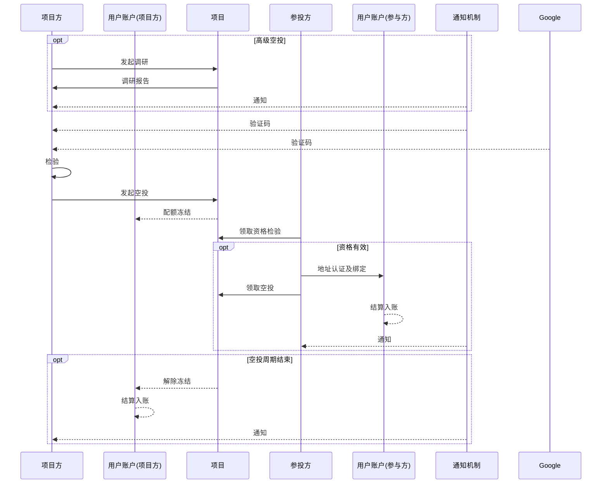

# 源铸产品设计
## 一、模块划分

功能模块

角色

## 二、业务场景案例

### 1. 用户相关流程

流程案例：用户登记

流程案例：用户密码重置

流程案例：用户冻结

流程案例：用户解冻

流程案例：用户检验信息解绑

### 2. 资产管理

流程案例：在线钱包(热)&离线钱包(冷)

流程案例：资产发行

流程案例：充值

流程案例：提币

### 3. 项目管理

流程案例：募集项目管理

流程案例：置换项目管理

流程案例：回收项目管理

流程案例：空投项目管理
